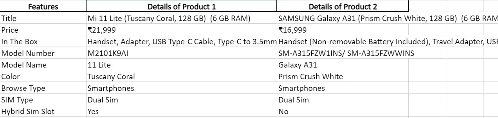
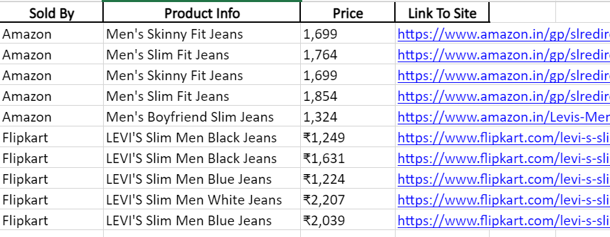

  

 

# Amazon-Flipkart-Price-Comparison-Engine
### Compares Product Specifications and Prices of Products on Top E-commerce Webites

It often becomes tiresome when we want to compare features of multiple products at the same time on an e-commerce website or compare prices of a product on different such websites. The python codes implemented efficiently solves the problem.

----------------------------

## product_comparator.py

The file contains the code that implements the product comparison feature. The user may query any number of products' **URL** on **Flipkart** they are interested in comparing
(e.g. mobile phones of different companies). The user is provided with a datasheet containing comparisons of all the specifications of the products they queried for.
 

  

 

-----------------------------
## price_comparator.py

The file contains the code that implements the price comparison feature. The user must enter the **name of any product** they wish to compare prices for.They are provided with a 
datasheet that contains the **prices** and the **link** to the webpage of the **top 5** search results relevant with the product name , on **Amazon** and **Flipkart**.
 

  

 

